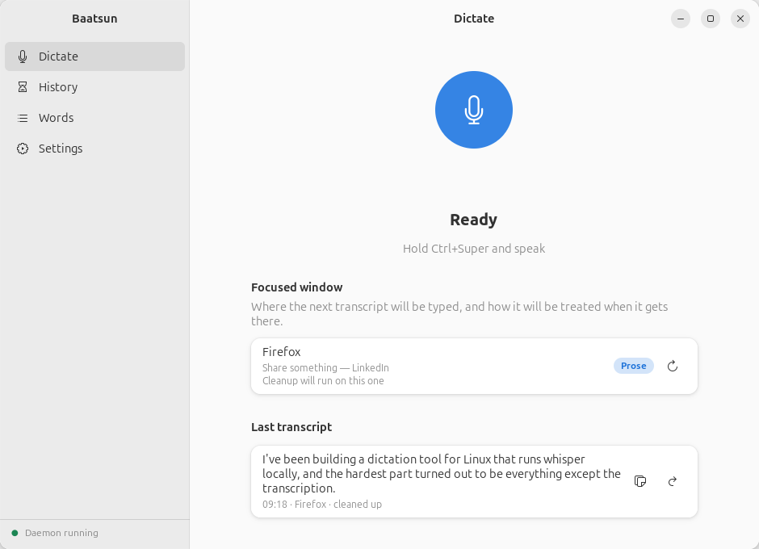
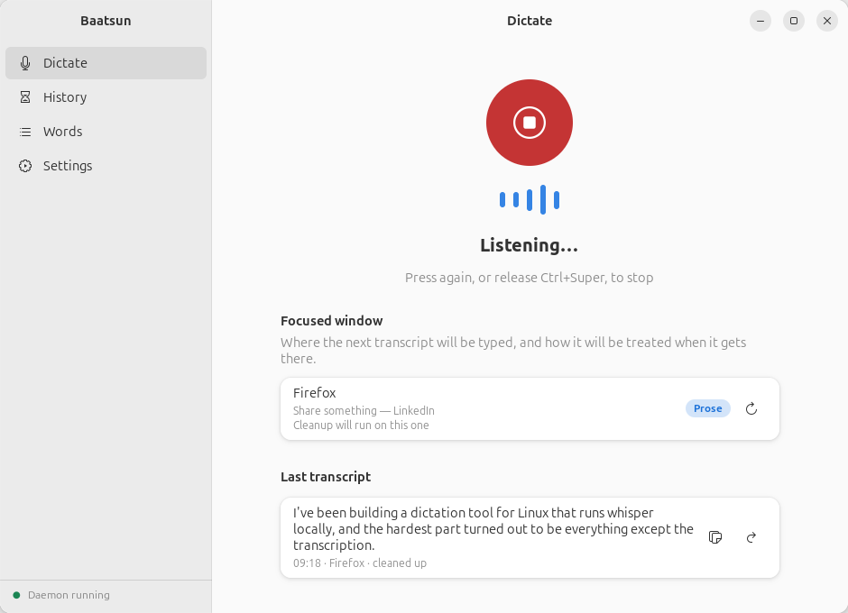
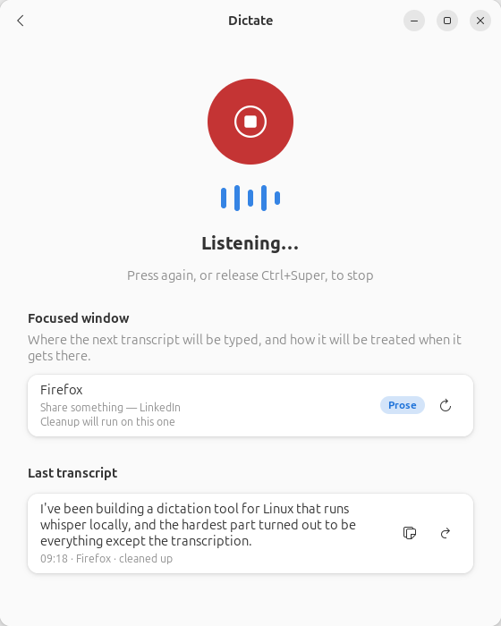

# Baatsun app mockup

**This has shipped, and has since been rebuilt.** The window this mocked up
shipped as `src/baatsun_gui.py`, which has now been replaced by the Electron
app in `electron/`. The shape below is what both implement, plus a
Home page that wasn't in the proposal. Kept here as the original argument and
as a place to try changes without touching the real window — it still talks to
nothing, so it can't break anything.

A runnable proposal for what the Baatsun window should be, instead of the
single history list with a modal settings dialog it replaced.

```sh
python3 mockup/baatsun_mockup.py
```

It talks to nothing — no daemon, no socket, no config file, no OpenAI. Nothing
you click here persists. Press the record button and it plays a scripted
dictation so you can watch the whole loop without a microphone.

It's built against the real GTK4/libadwaita toolkit rather than drawn in an
image editor, so it looks exactly like the shipped app would on this machine —
same widgets, same metrics, same theme.

## The shape

An `Adw.NavigationSplitView` with four places:

| | |
|---|---|
| **Dictate** | The live page. Record control, level meter, and the focused-window card. Doesn't exist today — currently the app can only tell you what you already said. |
| **History** | Today's list, grouped by day, with a cleaned/verbatim filter. |
| **Words** | Vocabulary as a managed list instead of one comma-separated field buried in Settings. |
| **Settings** | A page rather than a modal, with room for the model settings that are config-file-only today. |



The Dictate page uses the same three-way vocabulary as the pill — nothing,
bars, spinner — in the same order, so the window and the indicator are two
views of one instrument rather than two designs that happen to ship together.



Below 680px the sidebar collapses into a back button, so the window is usable
at half-screen width.



## The argument for the focused-window card

The classifier in `baatsun_context.py` decides whether what you are about to
say gets cleaned up or typed verbatim, and today that decision is completely
invisible until you read the result and notice it was rewritten. The card makes
it a thing you can look at before you speak. The refresh button next to it
cycles example windows so you can see both verdicts.

## Not yet backed by real data — resolved

All three are now implemented in the daemon; this section is kept for the
record of what the shape cost:

1. **The focused-window card.** The daemon already *receives* focus reports
   from the Shell extension and already classifies them, but never tells the
   GUI. Needs one more broadcast event.
2. **The per-entry app badge in History** ("Firefox", "Code"). Entries store
   `id`/`text`/`raw`/`ts` and nothing about where they were typed. Needs two
   more fields at append time.
3. **Any duration or word count.** Not stored at all. Nothing in the mockup
   shows these yet — an insights page would need them first.

Everything else maps to something that already exists.

## Regenerating the screenshots

`shots/` is committed so the design can be reviewed without running anything.
They're rendered out of GTK's own renderer inside a headless compositor, so
this needs no visible display and won't take over your screen:

```sh
mkdir -p /tmp/shot/rt && chmod 700 /tmp/shot/rt
XDG_RUNTIME_DIR=/tmp/shot/rt dbus-run-session -- \
  gnome-shell --headless --virtual-monitor 1100x760 &
sleep 8
XDG_RUNTIME_DIR=/tmp/shot/rt WAYLAND_DISPLAY=wayland-0 \
  python3 mockup/baatsun_mockup.py --capture mockup/shots
XDG_RUNTIME_DIR=/tmp/shot/rt WAYLAND_DISPLAY=wayland-0 \
  python3 mockup/baatsun_mockup.py --capture mockup/shots --narrow
```

Delete `shots/` if you'd rather not carry the images.
